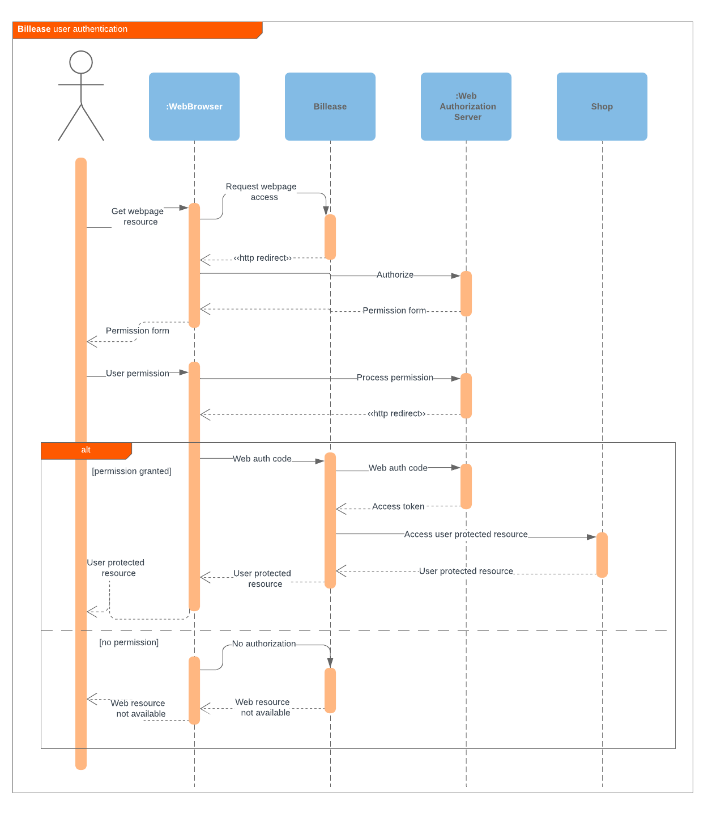

# Billease Developers Documentation

Welcome to the official Billease developers portal. Here you will find all needed information about integration with billease services.

## :page_facing_up: Merchant Registation

You have to register as a merchant in the [Merchant's portal](https://merchants.billease.ph).

Registration procedure as simple as possible

1. Fill the form --> 2. Application review --> 3. Done!

Please see details on the main site.

## :money_with_wings: Payment Process

## :key: Security

You will need sekurity key for integration with Billease api. You can download it in the Merchjant portal

## :bank: Integration API

### :construction_worker: Sandbox endpoint

This is development environment. You can use it for development and testing purposes.

[https://sandbox.payments.billease.ph](https://sandbox.payments.billease.ph)

### :bangbang: Production endpoint

Production endpoint:

[https://payments.billease.ph](https://payments.billease.ph)
