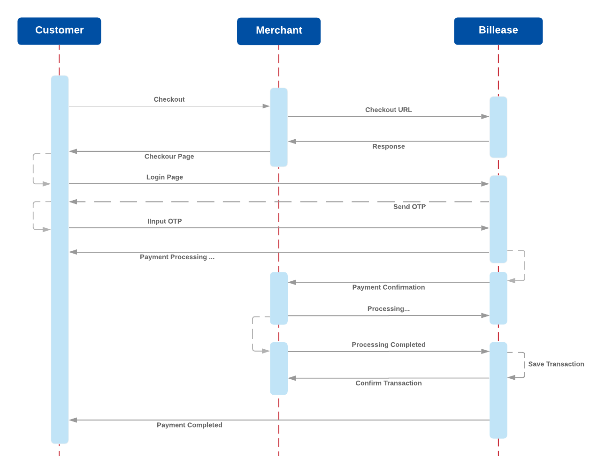

# Billease Developers Documentation


Welcome to the official Billease developers portal. Here you will find all needed information about integration with Billease services.

## Merchant Registration

You have to register as a merchant in the [Merchant's portal](https://merchants.billease.ph).

Registration procedure as simple as possible

```text
1. Fill the form --> 2. Form review --> 3. Done!
```

Please see details on the main site.

## Payment Process



## Security

You will need a security key for integration with Billease API. You can download it in the Merchant's portal

## Integration API

### Sandbox endpoint

This is a development environment. You can use it for development and testing purposes.

[https://sandbox.payments.billease.ph](https://sandbox.payments.billease.ph)

### Production endpoint

[https://payments.billease.ph](https://payments.billease.ph)
